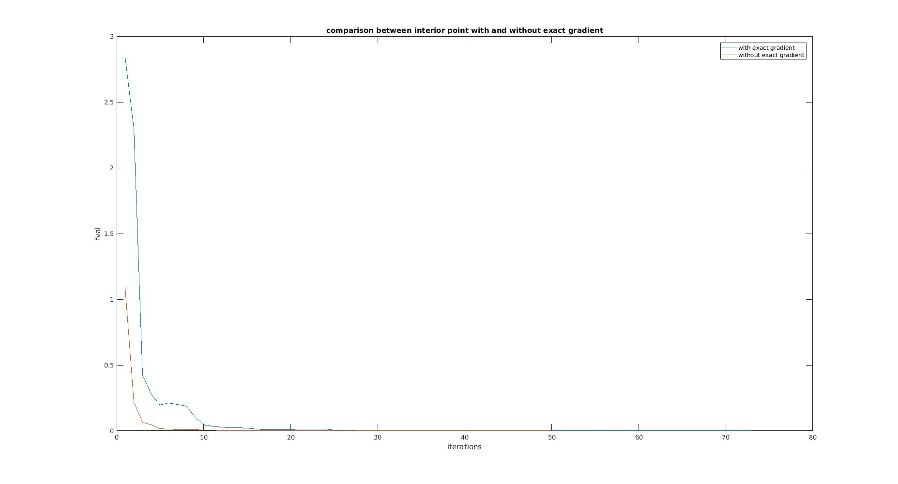

=======
#16-711: Kinematics, Dynamic Systems, and Control#
- Spring 2017
- HW1
- Team members: 
   - Guan-Horng Liu (guanhorl@andrew.cum.edu)
   - Arpit Agarwal (arpita1@andrew.cmu.edu)

##Usage##
- Run the script ```main```.
- Global variables:
   - ```method```: algorithm for solving optimization problem. 
   - ```localMin```: enable multiple local minimums searching in part 4.
NOTE: Matlab version is  2016a
##Problem Set##


###Part 1###
- Based on the original template code, several further optimizations were done. Including
   1. Global variable ```posLink```, which represents the end-point ```(x,y,z)``` position of each link in global frame, was directly stored at the time when we solved forward kinematic. Such variable is directly used in ```draw3()``` function for visualization.

   2. Usage of matrix representation of 3D Euler rotation matrix in function ```build_rotation_matrix(r,p,y)```, and collision check in function ```collision check```

- Obstacle collision check is done by recursively calculating the minimum distance from center of each sphere to each link.

- If target position is not reachable, it would be projected to the nearest point specified by robot maximum reachable radius. The closeness is defined in terms of Euclidean distance of the end-effector from the goal position.

- Demo Video:

[](https://youtu.be/-VxtBApTVHA)

###Part 2###
- We derived the derivative of score with respect to joint angles by calculating the symbolic representation of end-effector position wrt joint angles and using the ```jacobian``` functionwhich was evaluated using ```subs``` function in matlab . The derivative was feeded to the ```fmincon``` function to use for optimization instead of finite difference. The results obtained are as follows  

- Demo video
[](https://youtu.be/ljXw9X1Hqpg)
```
Number of iterations:155
fval = 1.0713e-04
solution obtained for joint angles
r = [ 0.0061,  0.0125, 0.0187]
p =[ -0.0308, 0.0057, 0.0281]
y =[-0.1998, 1.4005, 0.3696]
Run-time: 3447.548609 sec
```
Most of time was taken to calculate the exact gradients. The conversion was slower in terms of iterations as compared to method without exact gradients. The motion of the robot is smooth in both the methods. 

NOTE: This experiment was conducted without obstacles
###Part 3###
| Method        | Iterations| f-val  | Time(sec)|
| ------------- |:-----:| :---------:|:------------:|
| Interior point      | 54 | 1.0713e-04 |47.728608|
| sqp      | 49     |   1.0713e-04 |41.894020|
| active set | 16  |   1.0735e-04|15.311468|
|CMA-ES|333|0.0063|291.663268|

###Part 4###
In order to search for multiple local minimums, we utilized the ```MultiStart``` object in Matlab. Set the global variable ```localMin``` to ```true``` to enable multiple local minimums searching.

